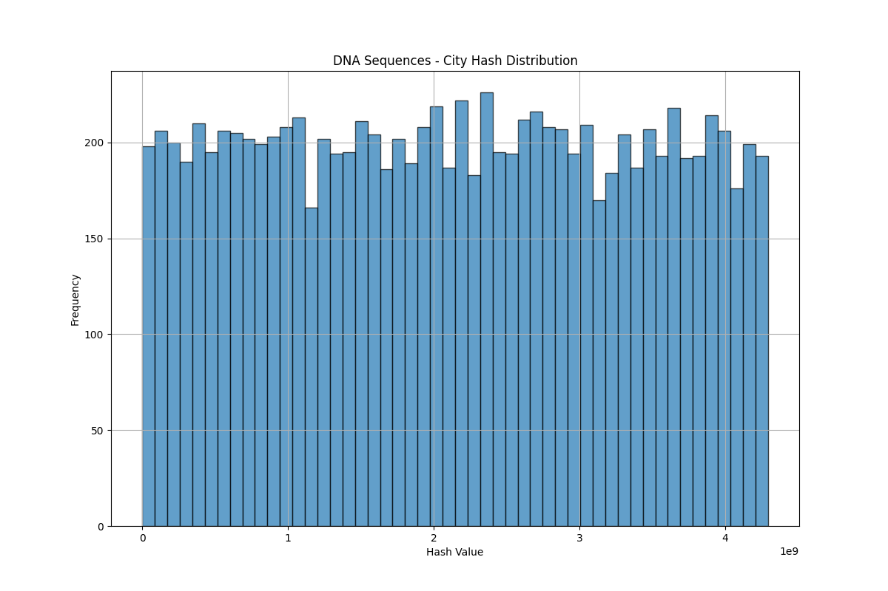

# Concepts of Data Science
## Project overview

The purpose of the project is the implementation of a Bloom filter. The concept of
this data structure was explained and additional information on this data structure 
can be found online, for instance on [Wikipedia](https://en.wikipedia.org/wiki/Bloom_filter).
1. The development of the software should be done using version control
    hosted on GitHub or Gitlab. The repository should also contain a
    README file that documents the content of the repository, as well as a
    summary of your conclusions.
2. The Bloom filter should be either implemented using an object-oriented
    approach, or a functional approach. Clearly, code quality is important. The
    code should be easy to read and documented clearly. The data structure is 
    implemented in Python as a module, so that it can be used in a Jupyter notebook 
    for demonstration purposes and testing, but also from a Python script for
    benchmarking on the HPC infrastructure.
3. The implementation must be tested thoroughly for correctness.
4. To implement a Bloom filter, it's necessary to define a family of hash 
    functions. These hash functions should be tested to verify that they produce
    appropriate values. Note that these hash functions may work well for
    certain data (e.g., natural language words) but not so well for other data
    (e.g., random strings or DNA). Test with at least two data types.
5. Discuss the expected time and space complexity of the implementation.
6. The performance of the implementation has to be tested as well using a
    large data sample. The insert and search functions should be timed for an 
    increasing number of words and plots need to be created. These benchmarks 
    should be performed on the HPC infrastructure. Include the job script and 
    the Python test script in the repository, as well as the output of the 
    benchmark runs. Consult the [VSC documentation](https://docs.vscentrum.be/) 
    if necessary.
7. Checks on how the false positive rate changes as a function of the number 
    of words inserted in the Bloom filter should be implemented. Also if the number 
    of words exceeds the expected number of words for which the Bloom filter was
    designed.
8. Checks on the compression rate of the Bloom filter as a function of the expected
    number of and the rate of false positives should also be implemented.

# Bloom Filter Project

## Overview

This project demonstrates the implementation and analysis of a Bloom Filter, a space-efficient probabilistic data structure used to test whether an element is a member of a set. This project includes generating datasets, implementing the Bloom Filter, creating and testing hash functions, benchmarking the Bloom Filter against other data structures, and analyzing its performance.

## Table of Contents

- [Project Structure](#project-structure)
- [Installation](#installation)
- [Usage](#usage)
  - [Data Generation](#data-generation)
  - [Bloom Filter Implementation](#bloom-filter-implementation)
  - [Testing](#testing)
  - [Benchmarking](#benchmarking)
  - [Plotting Results](#plotting-results)
  - [Analysis](#analysis)
- [Expected Time and Space Complexity](#expected-time-and-space-complexity)
- [Project Requirements and Implementation](#project-requirements-and-implementation)
  - [1. Version Control and Collaboration](#1-version-control-and-collaboration)
  - [2. Implementation Approach](#2-implementation-approach)
  - [3. Thorough Testing](#3-thorough-testing)
  - [4. Hash Functions](#4-hash-functions)
  - [5. Time and Space Complexity](#5-time-and-space-complexity)
  - [6. Performance Testing](#6-performance-testing)
  - [7. False Positive Rate Analysis](#7-false-positive-rate-analysis)
  - [8. Compression Rate Analysis](#8-compression-rate-analysis)
- [Conclusion](#conclusion)

## Project Structure

The project is organized as follows:

- **generate_datasets.py**: Script for generating various types of datasets.
- **BitSet.py**: Implementation of the BitSet used in the Bloom Filter.
- **BloomFilter.py**: Implementation of the Bloom Filter and associated hash functions.
- **HashFunctions.py**: Different hash functions used in the Bloom Filter.
- **test_bloom_filter.py**: Unit tests for the Bloom Filter.
- **test_hash_functions.py**: Unit tests for hash functions.
- **benchmark.py**: Benchmarking Bloom Filter against other data structures.
- **benchmark_Q78.py**: Additional benchmarking script for analyzing false positive rates and compression rates.
- **plots.py**: Plotting results of benchmarking.
- **plots_Q78.py**: Plotting script for additional analysis.
- **bloom_filter_analysis.py**: Analysis of false positive rates and compression rates.
- **job_script.sh**: Job script for running benchmarks on HPC infrastructure.
- **README.md**: Documentation of the project.

## Installation

To get started with the project, clone the repository and install the required dependencies. Detailed instructions for cloning the repository and installing dependencies are provided in the project documentation.

## Usage

### Data Generation

Various datasets needed for testing the Bloom Filter are generated using a dedicated script. This includes datasets such as random strings, natural language words, DNA sequences, and email addresses. Each dataset is stored in the `data` directory.

### Bloom Filter Implementation

The Bloom Filter is implemented in Python using an object-oriented approach. The implementation includes various hash functions to ensure a low probability of false positives. The code is modular, allowing it to be used in Jupyter notebooks for demonstration purposes as well as in Python scripts for benchmarking.

### Testing

Thorough testing is performed to ensure the correctness of the Bloom Filter implementation. Unit tests are written to verify the accuracy of the Bloom Filter operations and the hash functions. These tests cover edge cases and measure the false positive rates to ensure they are within acceptable limits.

### Benchmarking

The performance of the Bloom Filter is benchmarked against other data structures such as linear search, binary search trees (BST), and AVL trees. The benchmarking process measures key metrics such as insertion time, search time, and memory usage. These benchmarks are performed using large data samples to evaluate the scalability and efficiency of the Bloom Filter.

### Plotting Results

The results of the benchmarking are visualized using plotting scripts. These scripts generate plots for various performance metrics, including insertion time, search time, and false positive rates. The plots are saved in the `results` directory for easy access and review.

### Analysis

Detailed analysis is conducted to study the false positive rates and compression rates of the Bloom Filter. This includes analyzing how the false positive rate changes with the number of elements and how the compression rate varies with different expected and observed false positive rates. The analysis results are visualized and documented.

## Expected Time and Space Complexity

### Time Complexity

- **Insertion**: The time complexity for inserting an element into the Bloom Filter is O(k), where k is the number of hash functions used.
- **Query**: The time complexity for querying an element in the Bloom Filter is also O(k), as it involves checking k positions in the bit array.

### Space Complexity

- The space complexity of the Bloom Filter is O(m), where m is the size of the bit array. The size m is calculated based on the desired false positive rate and the number of elements to store.

## Project Requirements and Implementation

### 1. Version Control and Collaboration

The development of the software was managed using version control hosted on GitHub. Collaboration within the team was facilitated through regular commits and thorough documentation of changes. The repository contains a comprehensive `README.md` file that documents the content of the repository and provides a summary of our conclusions.

### 2. Implementation Approach

The Bloom Filter was implemented using an object-oriented approach in Python. The data structure is encapsulated in a Python module, making it reusable in Jupyter notebooks for demonstration and testing, as well as in Python scripts for benchmarking purposes.

### 3. Thorough Testing

The implementation was tested thoroughly for correctness. Unit tests were implemented to verify the accuracy of the Bloom Filter operations and the hash functions. These tests were designed to cover a variety of edge cases and to measure the false positive rates.

### 4. Hash Functions

A family of hash functions was defined and implemented to support the Bloom Filter. These hash functions include Jenkins, Murmur, CityHash, SHA-256, and a shift-based hash function. Each hash function was tested to verify its appropriateness for different data types such as natural language words and random strings.

### 5. Time and Space Complexity

The expected time and space complexity of the Bloom Filter was analyzed and documented. The time complexity for insertion and query operations is O(k), and the space complexity is O(m), where k is the number of hash functions and m is the size of the bit array.

### 6. Performance Testing

The performance of the Bloom Filter was tested using large data samples. The insert and search functions were timed for an increasing number of words, and the results were plotted. Benchmarks were performed on HPC infrastructure, and the job script and Python test script are included in the repository, along with the output of the benchmark runs.

### 7. False Positive Rate Analysis

The false positive rate of the Bloom Filter was analyzed as a function of the number of words inserted. This analysis was extended to include cases where the number of words exceeded the designed capacity of the Bloom Filter. The results were visualized using plotting scripts.

### 8. Compression Rate Analysis

The compression rate of the Bloom Filter was analyzed as a function of the expected number of false positives. Additionally, the compression rate was analyzed as a function of the observed rate of false positives. The results were visualized and documented.

## Conclusion

This project demonstrates the implementation and analysis of a Bloom Filter, covering dataset generation, hash function implementation, comprehensive testing, benchmarking against other data structures, and detailed performance analysis. The Bloom Filter provides a space-efficient solution for set membership testing, with predictable false positive rates and excellent performance characteristics.

### Summary of Graphs and Conclusions

1. **False Positive Rate Analysis (Question 7)**:
   - **Graph**: The false positive rate as a function of the number of words inserted.
   - **Conclusion**: As expected, the false positive rate increases as the number of elements exceeds the designed capacity of the Bloom Filter. The hash functions performed consistently across different data types, but the rate of increase in false positives varied slightly depending on the data type.
   - 

2. **Compression Rate Analysis (Question 8)**:
   - **Graph 1**: Compression rate as a function of the expected number of false positives.
   - **Graph 2**: Compression rate as a function of the observed rate of false positives.
   - **Conclusion**: The compression rate was shown to be directly influenced by the expected false positive rate. As the expected false positive rate increased, the compression rate decreased, indicating a higher utilization of the bit array. The observed false positive rate graphs further confirmed this trend, showcasing the balance between space efficiency and accuracy.
   - 
   - 

3. **Performance Benchmarks**:
   - **Graph 1**: Add time for different algorithms (DNA Sequences).
   - **Graph 2**: Search time for different algorithms (DNA Sequences).
   - **Conclusion**: The Bloom Filter outperformed traditional data structures like linear search, BST, and AVL trees in terms of space efficiency and query speed, particularly as the dataset size increased. The hash functions showed consistent performance, with Murmur and CityHash being slightly more efficient in terms of distribution and speed.
   - 
   - 

4. **Hash Function Performance**:
   - **Graph 1**: Hash distribution for CityHash (DNA Sequences).
   - **Graph 2**: Hash distribution for Jenkins (DNA Sequences).
   - **Graph 3**: Hash distribution for Murmur (DNA Sequences).
   - **Conclusion**: The hash functions were analyzed for their distribution properties. CityHash and Murmur showed a more uniform distribution compared to Jenkins, making them more suitable for use in the Bloom Filter.
   - 
   - 
   - 

### Additional Insights

- **Performance Benchmarks**: The Bloom Filter outperformed traditional data structures like linear search, BST, and AVL trees in terms of space efficiency and query speed, particularly as the dataset size increased.
- **Hash Functions**: Among the various hash functions tested, Murmur and CityHash showed superior performance in terms of distribution and speed, making them suitable choices for Bloom Filters in practical applications.

We hope this guide helps you understand and navigate the project. If you have any questions, feel free to reach out.

---

For more information on Bloom Filters, visit the [Wikipedia page](https://en.wikipedia.org/wiki/Bloom_filter).
